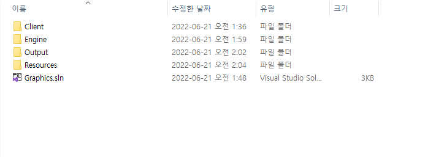

# 프로젝트 설정

# context

[1. 프로젝트 초기화](#프로젝트-초기화)

[1-1. PreCompileHeader](#precompileheader)

[1-2. Init, Update](#init-update)

[1-3. 프로젝트 설정](#메뉴-제거)

[2. 엔진 연결](#엔진-연결)

[2-1. 정적 라이브러리 생성](#1-정적-라이브러리-생성)

[2-1-1. 동적 라이브러리, 정적 라이브러리](#동적-라이브러리-정적-라이브러리)

[2-2. 엔진 구성](#2-엔진-구성)

[2-3. 클라이언트에서 엔진 쓰기](#3-클라이언트에서-엔진-쓰기)

# 프로젝트 초기화

Window응용 프로그램에서 그래픽스를 공부한다.

새 프로젝트에서 Window응용 프로그램을 만들면 된다.

이때 응용 프로그램이 Busy Wait하는 부분을 볼 수 있는데 아래와 같이 수정한다.

```csharp
while (true)
{
    if (PeekMessage(&msg, nullptr, 0, 0, PM_REMOVE))
    {
        if(msg.message == WM_QUIT)
        {
            break;
        }

        if (!TranslateAccelerator(msg.hwnd, hAccelTable, &msg))
        {
            TranslateMessage(&msg);
            DispatchMessage(&msg);
        }
    }

    //TODO.

}
```

- 메시지만 받았을때 반응하게 바꿀 수 있다.

## PreCompileHeader

- 미리 컴파일 하는 헤더
- 유니티 빌드 처럼 자주 사용되는 라이브러리를 묶어둠
- 대부분 stdafx.h와 pch.h 와같은 이름으로 되어있음

만드는 방법

- “프로젝트 우클릭” → “설정” → “C/C++” → “미리 컴파일된 헤더”를 사용체크
- class를 만들어서 해당 class의 구현부나 선언부를 지우고 해당 파일에 인크루드 하면된다.
- cpp에 우클릭 → 속성 → 미리 컴파일 된 헤더 만들기로 바꿔 줘야 한다.
- 해당 파일을 inclue을 main에서 하지 않으면 에러가 난다.
- 이후 추가되는 class에는 해당 헤더가 자동으로 포함된다.

# Init, Update

Unity에서는 Update UE에서는 Tick을 구현한다.

위의 초기화 구문에서 한곳에 넣어준다

아래와 같이 Game을 관리하는 class를 만들어서 해당 함수를 넣어준다.

- Game

  ```csharp
  #pragma once

  class Game
  {
  public:
      void init();
      void Update();
  };
  ```

- Client

  ```csharp
  Game* game = new Game;
  game->init();

  // 기본 메시지 루프입니다:
  while (true)
  {
      if (PeekMessage(&msg, nullptr, 0, 0, PM_REMOVE))
      {
          if (msg.message == WM_QUIT)
          {
              break;
          }

          if (!TranslateAccelerator(msg.hwnd, hAccelTable, &msg))
          {
              TranslateMessage(&msg);
              DispatchMessage(&msg);
          }
      }

      //TODO.
      game->Update();
  }
  ```

  Heap에 객체를 만들어 복사를 최소화 한다.
  while전에 Init을 한다.
  Tick당 Update를 한번씩 호출하게 한다.

## 메뉴 제거

아래 보면 이와 같은 구조가 있다

```csharp
wcex.style          = CS_HREDRAW | CS_VREDRAW;
wcex.lpfnWndProc    = WndProc;
wcex.cbClsExtra     = 0;
wcex.cbWndExtra     = 0;
wcex.hInstance      = hInstance;
wcex.hIcon          = LoadIcon(hInstance, MAKEINTRESOURCE(IDI_CLIENT));
wcex.hCursor        = LoadCursor(nullptr, IDC_ARROW);
wcex.hbrBackground  = (HBRUSH)(COLOR_WINDOW+1);
wcex.lpszMenuName   = MAKEINTRESOURCEW(IDC_CLIENT);
wcex.lpszClassName  = szWindowClass;
wcex.hIconSm        = LoadIcon(wcex.hInstance, MAKEINTRESOURCE(IDI_SMALL));
```

- 여기서 MenuName을 nullptr로 바꾸면 된다.

# 엔진 연결?

엔진을 라이브러리를 통하여 구현을 하게 된다.

> **라이브러리**(영어: library)
> 주로 소프트웨어를 개발할 때 컴퓨터 프로그램이 사용하는 비휘발성 자원의 모임이다.

## 1. 정적 라이브러리 생성

### 동적 라이브러리, 정적 라이브러리

동적 라이브러리

- 실행되는 순간에 프로젝트에서 동적으로 변경 가능한 라이브러리
  - 실행 시점에 다른곳에서 가져온다.
    > 동적 라이브러리
    > 프로그램 수행 도중 해당 모듈이 필요할 때 불러쓰는 프로그램 모듈이다. 윈도우에서는 주로 DLL 확장자를 가지며, 리눅스에서는 주로 SO 확장자를 가진다.

정적 라이브러리

- 프로젝트 자체에 딸려서 같이 오는 것들
  - 패키징으로 같이오는 자료들
    > **정적 라이브러리**(Static Library)
    > 정적 라이브러리는 컴파일러가 소스 파일을 컴파일할 때 참조되는 프로그램 모듈이다. 즉, 정적 라이브러리(statically-linked library)는 루틴(routine) 외부 함수와 변수들의 집합으로, 컴파일러, 링커, 바인더 등에 의해 목표된 애플리케이션으로 복사되어 오브젝트 파일과 독립적으로 실행할 수 있는 실행 파일을 생성하는데에 사용된다. 윈도의 .LIB파일과 같이 .a의 확장자를 갖고있다.

정적 라이브러리로 엔진을 만든다.

- “솔루션 우클릭 → 추가 → 새 프로젝트 → 정적 라이브러리” 로 추가할 수 있다.
- 이렇게 만들면 솔루션에 lib즉 정적 라이브러리가 생성된다.
  - Client는 exe파일로 만들어져 있다.

## 2. 엔진 구성

- frameWork의 include를 pch로 옮긴다.(정리를 위해)
- 필터에 Engine, Utils, Resource를 추가해 준다.
- 이후 EnginePch Class를 만들어 준다.
  - 해당 파일에 각종 include를 하고, pch에 해당 파일을 inclue한다.
- 여기에 STL, DirectX, lib, typedef를 선언해 준다.

  ```csharp
  #pragma once

  // 각종 include
  #include <windows.h>
  #include <tchar.h>
  #include <memory>
  #include <string>
  #include <vector>
  #include <array>
  #include <list>
  #include <map>
  using namespace std;

  // 해당은 공식 지원을 하지 않아서 다운하면 좋다.
  #include "d3dx12.h"
  #include <d3d12.h>
  #include <wrl.h>
  #include <d3dcompiler.h>
  #include <dxgi.h>
  #include <DirectXMath.h>
  #include <DirectXPackedVector.h>
  #include <DirectXColors.h>
  using namespace DirectX;
  using namespace DirectX::PackedVector;
  using namespace Microsoft::WRL;

  // 각종 lib
  #pragma comment(lib, "d3d12")
  #pragma comment(lib, "dxgi")
  #pragma comment(lib, "dxguid")
  #pragma comment(lib, "d3dcompiler")

  // 각종 typedef
  // 별명
  using int8 = __int8;
  using int16 = __int16;
  using int32 = __int32;
  using int64 = __int64;
  using uint8 = unsigned __int8;
  using uint16 = unsigned __int16;
  using uint32 = unsigned __int32;
  using uint64 = unsigned __int64;
  using Vec2 = XMFLOAT2;
  using Vec3 = XMFLOAT3;
  using Vec4 = XMFLOAT4;
  using Matrix = XMMATRIX;

  void HelloEngine();
  ```

  - 보면 `#include "d3dx12.h"`이 에러가 난다.
    - 공식으로 지원하지는 않기 때문에 해당 파일을 다운해서 인크루드 한다.

### 결과물 필터링

- 결과물이 해당 솔루션에서 여러곳에서 뜨기 때문에 폴더를 만들어서 관리한다.
- “솔루션 우클릭 → 속성 → 일반 → 출력 디렉터리”를 설정 해 주면 된다.
  

## 3. 클라이언트에서 엔진 쓰기

클러에게 정적 라이브러리(lib)와 헤더파일 경로를 줘야 한다.

- 헤더는 Engine에, lib는 Output에 있다.
- 상대 경로가 훨신 좋다.
- “솔루션(클라이언트) 우클릭 → 속성 → VC++ 디렉터리” 를 설정 해주면 된다.
  lib는 라이브러리 디렉터리
  헤더는 포함 디렉터리

현재 Engine에서 `HelloEngine()`을 생성 하였는데 이를 Client에서 사용해 본다.

1. Game에서 `HelloEngine()`을 친다.

   인크루드 에러 발생

2. pch.h에서 `#include "EnginePch.h"`를 입력 해 준다.

   링크 에러가 뜬다.

   → 라이브러리 링크가 되어있지 않음

   - “Client 우클릭 → 속성 → 링커 → 입력 → 추가 종속성“에 lib를 추가해준다.
     해당 방법은 하나하나 추가해야 해서 너무 귀찮다…
   - `#pragma comment`를 사용
     #pragma comment(lib, "Engine.lib")를 pch.h에 추가 하면된다.
     전처리기를 사용하는 방법!!

→ 정적 연결 성공!! HelloEngine()이 실행 된다!!
